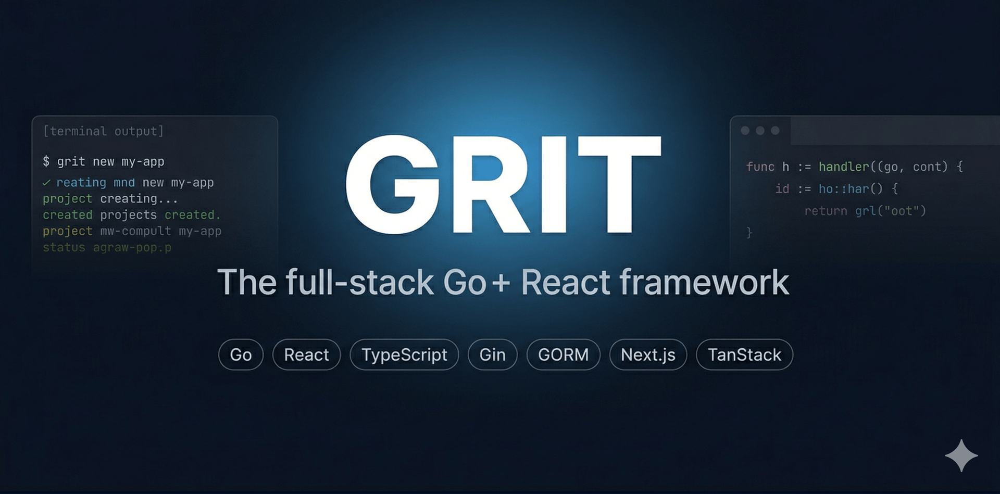

<p align="center">
  
</p>

<h1 align="center">Grit</h1>

<p align="center">
  <strong>Go + React. Built with Grit.</strong>
</p>

<p align="center">
  <a href="https://github.com/MUKE-coder/grit/releases"></a>
  <a href="https://github.com/MUKE-coder/grit/blob/main/LICENSE"></a>
  <a href="https://gritframework.dev"></a>
</p>

<p align="center">
  The full-stack Go + React framework. Choose your architecture, pick your frontend, and scaffold a production-ready application in seconds.
</p>

---

## What is Grit?

Grit is a full-stack meta-framework that fuses **Go** (Gin + GORM) with **Next.js** or **TanStack Router** (Vite) in a flexible architecture. One interactive CLI to scaffold a complete production-ready project with authentication, 2FA, admin panel, code generation, file storage, email, background jobs, AI integration, one-command deployment, and Docker setup.

## Install

One-line install — works on macOS, Linux, and Windows (PowerShell or Git Bash). No Go toolchain required:

```bash
curl -fsSL https://gritframework.dev/install.sh | sh
```

Pin a specific version:

```bash
GRIT_VERSION=v3.26.1 curl -fsSL https://gritframework.dev/install.sh | sh
```

Already have Go installed? `go install` still works as an alternative:

```bash
go install github.com/MUKE-coder/grit/v3/cmd/grit@latest
# or pin: go install github.com/MUKE-coder/grit/v3/cmd/grit@v3.26.1
```

Verify the install:

```bash
grit version
# grit version 3.26.1
```

Update to the latest release:

```bash
grit update
```

## Quick Start

```bash
# Interactive — choose architecture + frontend
grit new myapp

# Or use flags to skip prompts
grit new myapp --triple --next       # Web + Admin + API (Next.js)
grit new myapp --double --vite       # Web + API (TanStack Router)
grit new myapp --single              # Single Go binary + embedded SPA
grit new myapp --api                 # Go API only
grit new . --triple --vite           # Scaffold into current directory
grit new ./ --triple --vite          # Same as above
grit new-desktop myapp               # Native desktop app (Wails)
```

Tip: when using `grit new .`, Grit infers the project name from your current folder name. Use `--force` if the directory is non-empty.

```bash
cd myapp
docker compose up -d    # PostgreSQL, Redis, MinIO, Mailhog
pnpm install && pnpm dev
```

Open http://localhost:3000 — register, log in, see the dashboard.

## Architecture Modes

| Mode | Command | What You Get |
|------|---------|-------------|
| **Triple** | `grit new app --triple` | Web + Admin + API (monorepo, Turborepo) |
| **Double** | `grit new app --double` | Web + API (no admin, lighter) |
| **Single** | `grit new app --single` | Go binary with `go:embed` frontend (like Laravel/Next.js) |
| **API** | `grit new app --api` | Go API only (no frontend) |
| **Mobile** | `grit new app --mobile` | API + Expo React Native |
| **Desktop** | `grit new-desktop app` | Wails + Go + React + SQLite |

## Frontend Options

| Frontend | Flag | Stack |
|----------|------|-------|
| **Next.js** (default) | `--next` | App Router, Server Components, SSR/ISR |
| **TanStack Router** | `--vite` | Vite, file-based routing, SPA, faster builds |

## What Ships With Every Project

| Feature | Details |
|---------|---------|
| **JWT Authentication** | Register, login, refresh tokens, role-based access (ADMIN/EDITOR/USER) |
| **Two-Factor Auth (TOTP)** | Authenticator app, 10 backup codes, 30-day trusted devices |
| **OAuth2 Social Login** | Google + GitHub via `goth` |
| **File Storage (S3)** | Presigned URL uploads to AWS S3, Cloudflare R2, or MinIO |
| **Email (Resend)** | Transactional emails with Go HTML templates |
| **Background Jobs** | Redis-backed queue via `asynq` with admin dashboard |
| **Cron Scheduler** | Recurring tasks with cron expressions |
| **AI Integration** | Vercel AI Gateway — one key, hundreds of models |
| **Redis Caching** | Get/Set/Delete + cache middleware for responses |
| **GORM Studio** | Visual database browser at `/studio` |
| **API Documentation** | Auto-generated Scalar docs at `/docs` |
| **Sentinel** | WAF, rate limiting, brute-force protection at `/sentinel/ui` |
| **Pulse** | Request tracing, DB monitoring, metrics at `/pulse/ui` |
| **Grit UI** | 100 pre-built shadcn-compatible components |
| **Docker** | Dev + production Docker Compose setups |

## Code Generator

```bash
# Generate a full-stack resource
grit generate resource Post --fields "title:string,content:richtext,published:bool,slug:slug:title"

# Interactive mode
grit generate resource Product -i

# From YAML
grit generate resource Post --from post.yaml

# Remove a resource (deletes files + reverses injections)
grit remove resource Post
```

**Generated files per resource:** Go model, service, handler, Zod schema, TypeScript types, React Query hooks, admin page, route injection — all via code markers.

## CLI Commands

```bash
# Scaffolding
grit new <name>                        # Interactive (architecture + frontend)
grit new <name> --triple --next        # Explicit flags
grit new . --triple --vite             # Scaffold into current directory
grit new-desktop <name>                # Desktop app (Wails)

# Code generation
grit generate resource <Name> --fields "..."
grit remove resource <Name>
grit add role <ROLE_NAME>
grit sync                              # Go types → TypeScript + Zod

# Development
grit start                             # Auto-detect project, start dev server
grit start client                      # Start frontend apps
grit start server                      # Start Go API
grit studio                            # Open GORM Studio
grit routes                            # List all registered API routes

# Database
grit migrate                           # Run migrations
grit migrate --fresh                   # Drop + re-migrate
grit seed                              # Seed database

# Operations
grit down                              # Maintenance mode (503 all requests)
grit up                                # Back online
grit deploy --host user@server.com --domain myapp.com

# Meta
grit version                           # v3.26.1
grit update                            # Self-update to latest
grit upgrade                           # Upgrade project templates
```

## Field Types

| Type | Go Type | TypeScript | Notes |
|------|---------|-----------|-------|
| `string` | `string` | `string` | Required by default |
| `text` | `string` | `string` | GORM `type:text` |
| `richtext` | `string` | `string` | Tiptap WYSIWYG editor |
| `int` | `int` | `number` | |
| `uint` | `uint` | `number` | |
| `float` | `float64` | `number` | |
| `bool` | `bool` | `boolean` | |
| `datetime` | `*time.Time` | `string\|null` | |
| `date` | `*time.Time` | `string\|null` | |
| `slug` | `string` | `string` | Auto-unique from source |
| `belongs_to` | `uint` | `number` | FK + index |
| `many_to_many` | `[]uint` | `number[]` | Junction table |
| `string_array` | `datatypes.JSONSlice[string]` | `string[]` | JSON column |

**Modifiers:** `:unique`, `:optional`, `:slug:<source>`, `:belongs_to:<Model>`, `:many_to_many:<Model>`

## Tech Stack

| Layer | Technology |
|-------|-----------|
| Backend | Go 1.21+ · Gin · GORM |
| Frontend | Next.js 14+ (App Router) **or** TanStack Router (Vite) |
| Styling | Tailwind CSS · shadcn/ui |
| Database | PostgreSQL (dev: Docker) · SQLite (desktop/single) |
| Cache / Queue | Redis · asynq |
| File Storage | S3-compatible (MinIO / Cloudflare R2 / AWS S3) |
| Email | Resend |
| AI | Vercel AI Gateway (Anthropic, OpenAI, Google, and more) |
| Auth | JWT + TOTP (2FA) + OAuth2 (Google, GitHub) |
| Validation | Zod (shared between apps) |
| Data Fetching | TanStack Query |
| Monorepo | Turborepo · pnpm |
| Security | Sentinel (WAF + rate limiting) |
| Observability | Pulse (tracing + metrics) |
| DB Browser | GORM Studio |
| Desktop | Wails v2 |
| Deployment | SSH + systemd + Caddy (auto-TLS) |

## Plugins

10 official drop-in Go packages for functionality that doesn't ship in core:

| Plugin | Package | Purpose |
|--------|---------|---------|
| [grit-websockets](https://github.com/MUKE-coder/grit-plugins/tree/main/grit-websockets) | `ws` | Hub, rooms, broadcast, auth |
| [grit-stripe](https://github.com/MUKE-coder/grit-plugins/tree/main/grit-stripe) | `gritstripe` | Checkout, subscriptions, webhooks |
| [grit-oauth](https://github.com/MUKE-coder/grit-plugins/tree/main/grit-oauth) | `oauth` | Google, GitHub, Discord social login |
| [grit-notifications](https://github.com/MUKE-coder/grit-plugins/tree/main/grit-notifications) | `notify` | In-app, push (FCM), SMS (Twilio) |
| [grit-search](https://github.com/MUKE-coder/grit-plugins/tree/main/grit-search) | `search` | Meilisearch + GORM auto-index |
| [grit-video](https://github.com/MUKE-coder/grit-plugins/tree/main/grit-video) | `video` | Upload, FFmpeg, HLS streaming |
| [grit-conference](https://github.com/MUKE-coder/grit-plugins/tree/main/grit-conference) | `conference` | WebRTC signaling, rooms |
| [grit-webhooks](https://github.com/MUKE-coder/grit-plugins/tree/main/grit-webhooks) | `webhooks` | Outgoing webhooks, HMAC, retry |
| [grit-i18n](https://github.com/MUKE-coder/grit-plugins/tree/main/grit-i18n) | `i18n` | Translation, locale middleware |
| [grit-export](https://github.com/MUKE-coder/grit-plugins/tree/main/grit-export) | `export` | PDF, Excel, CSV generation |

## Documentation

Full docs at **[gritframework.dev](https://gritframework.dev)** — architecture guides, tutorials, the 10-course free curriculum at [/courses](https://gritframework.dev/courses), API reference, deployment, and plugin documentation.

## License

MIT
